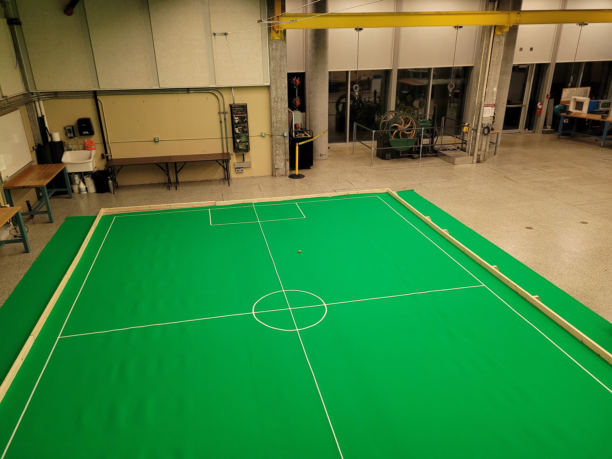
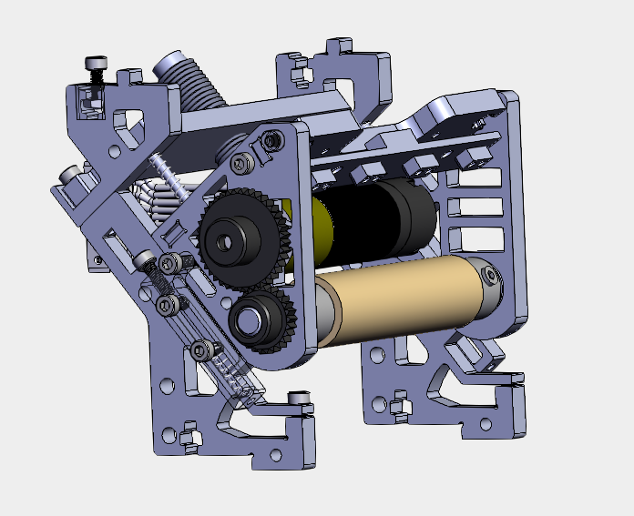
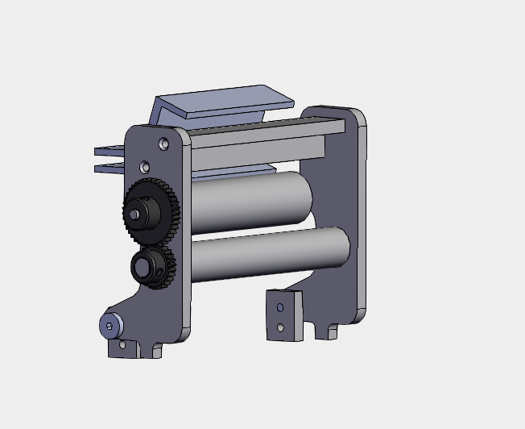
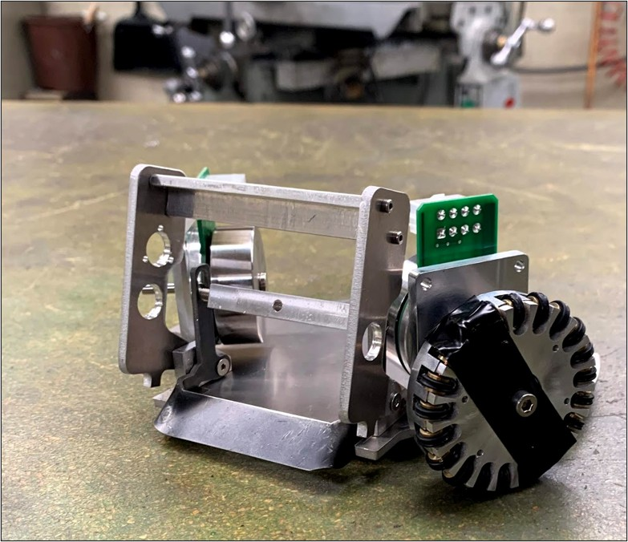
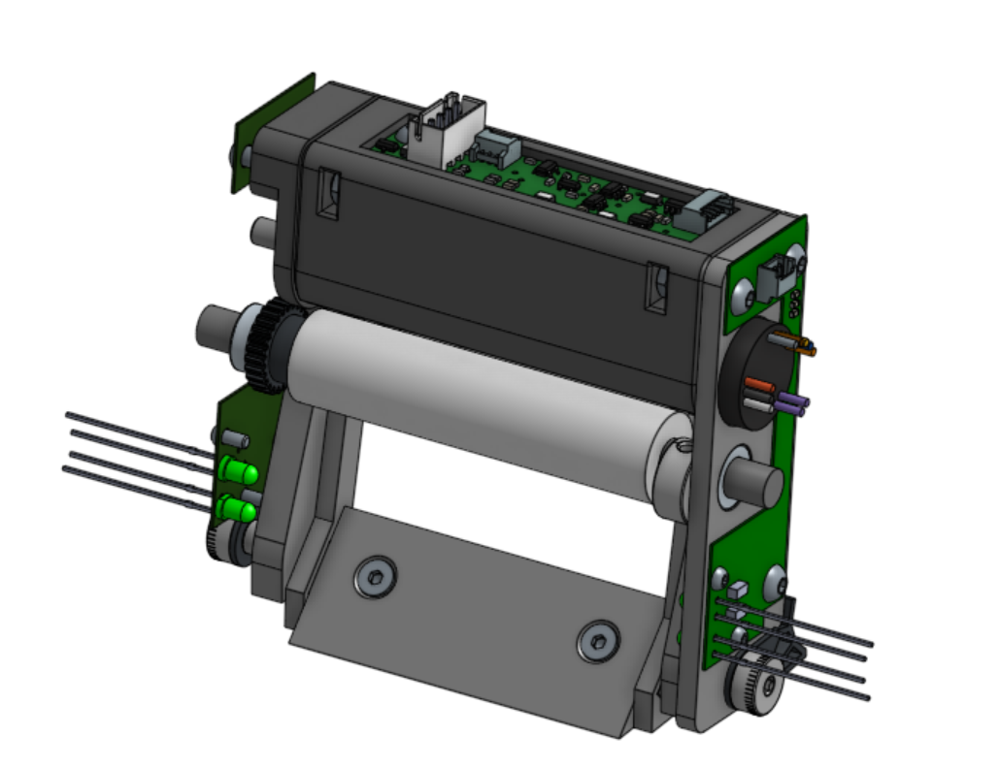
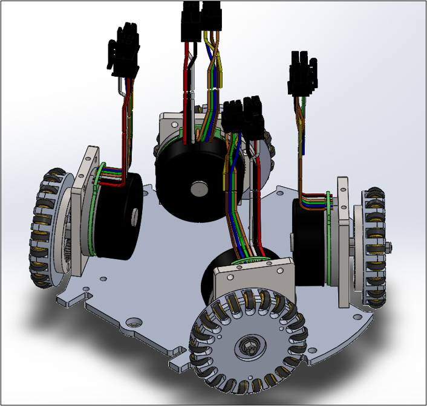
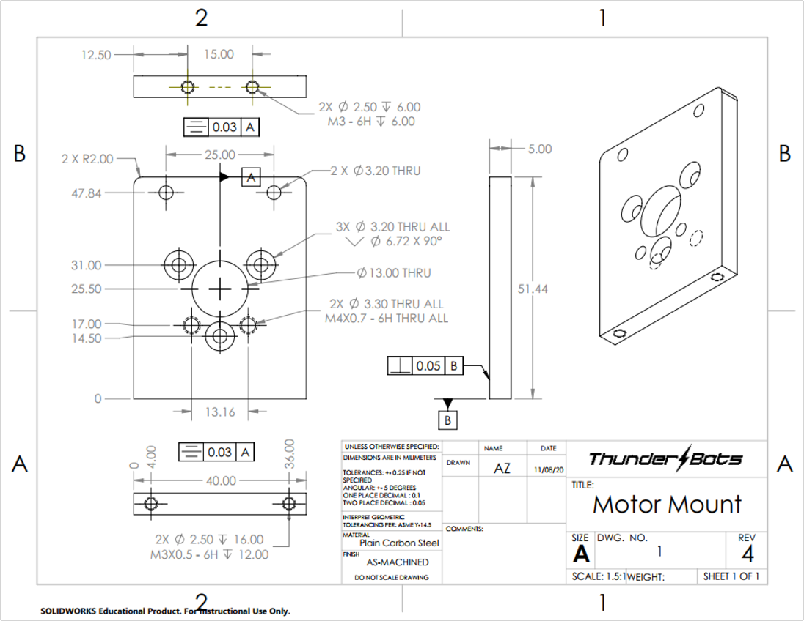
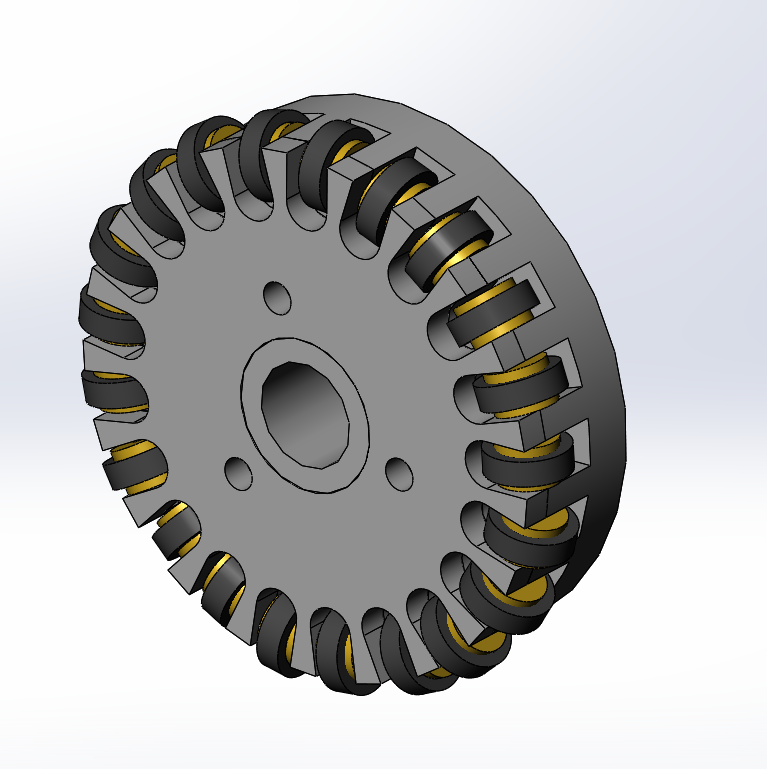
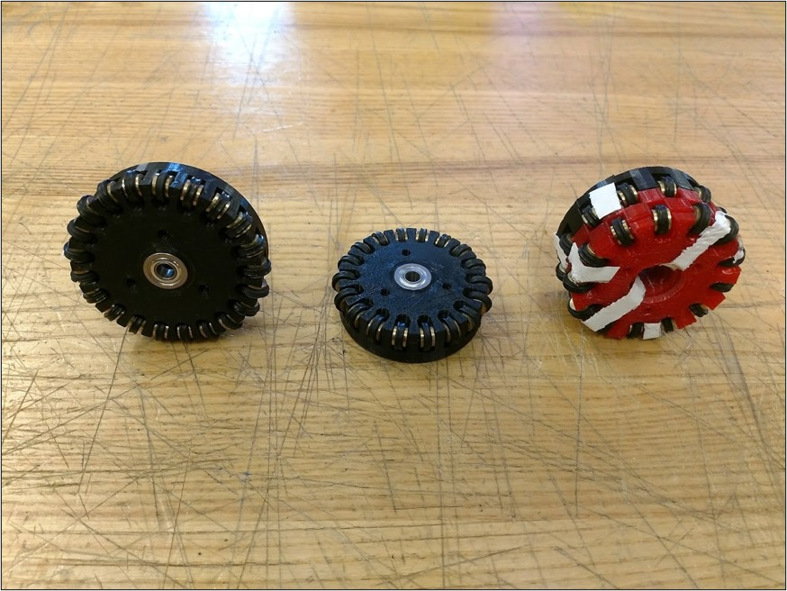

# UBC Thunderbots — RoboCup Small Size League

**University of British Columbia** | Sept 2019 – May 2025

> My home for five years — designing, building, and integrating autonomous soccer-playing robots competing in the [RoboCup Small Size League](https://ssl.robocup.org/), where teams of six robots play fully autonomous soccer at high speed.

---

## My Roles

| Period | Role |
|---|---|
| 2024 – 2025 | Integration Lead |
| 2022 – 2024 | Captain |
| 2020 – 2022 | Mechanical Lead |
| 2019 – 2020 | Mechanical Member |

---

## Competition Results & Media

### RoboCup 2024 — Eindhoven, Netherlands 🥈
**2nd Place, Division B, Small Size League**

  

### Team Description Papers
Co-authored annual technical reports submitted as part of the RoboCup SSL qualification process, covering integration of mechanical, electrical, and software systems.

- [2025 Team Description Paper](https://ssl.robocup.org/wp-content/uploads/2025/04/2025_TDP_UBC-Thunderbots.pdf)
- [2024 Team Description Paper](https://ssl.robocup.org/wp-content/uploads/2024/04/2024_TDP_Thunderbots.pdf)
- [2023 Team Description Paper](https://ssl.robocup.org/wp-content/uploads/2023/02/2023_TDP_UBC_Thunderbots.pdf)
- [2022 Team Description Paper](https://ssl.robocup.org/wp-content/uploads/2022/04/2022_TDP_UBC-Thunderbots.pdf)
- [2020 Team Description Paper](https://ssl.robocup.org/wp-content/uploads/2020/03/2020_TDP_UBC_Thunderbots.pdf)

### Qualification & Match Videos
- [UBC Thunderbots YouTube Channel](https://www.youtube.com/@UBCThunderbots](https://youtu.be/dhpJPy4J4jo?si=9Ff488bRIfZNccoC))

---

## Projects

### Robot Integration *(2021 – 2025)*

As Integration Lead and Captain, I founded and led Thunderbots' first dedicated Integration Team — responsible for bridging mechanical, electrical, and software subsystems and ensuring the full robot stack was reliable under match conditions.

**Key contributions:**
- Founded the Integration Team to formalise cross-subsystem debugging and pre-competition validation
- Designed test plans to verify points of failure in the kicking and chipping mechanisms, and calibrated solenoid output forces
- Developed diagnostic tools and custom jigs for validating hardware/software interactions
- Directed real-time emergency repairs and tactical adjustments during live international competition
- Spearheaded construction of a 17m × 20m practice field for full-scale gameplay testing

<!-- Add photos of test jigs, field, robots in competition -->

**Test footage**
- [Obstacle Avoidance & Ball Retrieval](https://youtu.be/cILfb-S7bKM): path planning and tracking performance
- [Chipper Testing](https://youtu.be/kkc0J0bwD34): benchmarking solenoid output vs chip distance
- [Drivetrain slippage testing](https://youtu.be/dhpJPy4J4jo?si=qYpjCL241TnXLHCN): observing slippage during acceleration
<!--  -->

---

### Dribbler & Damper Redesign *(Jan 2020 – Jul 2022)*

Redesigned UBC Thunderbots' mechanical ball control system — the dribbler and damper assembly responsible for capturing and controlling the ball at speed.

The design I led used an aluminium frame rotating about a pivot point with a threaded polyurethane roller bar, optimised for reliable ball contact across a range of approach angles.

**Key contributions:**
- Led a team of 5 members through the full design-build-test cycle
- Designed four prototype iterations, culminating in the final design used at competition in July 2022
- Manufactured and assembled prototypes using SolidWorks, 3D printing, and machine tools
- Generated and reviewed engineering drawings for each iteration

<!-- Add prototype photos and/or CAD renders here -->

  
  
  
    <em> Left: Old design | Middle: Initial redesign (2020) | Right: Physical prototype (2020) </em>

  
    <em> Final Dribbler used in 2024 competition </em>

  
<!--  -->

---

### Drivetrain Redesign *(Sept 2019 – Jul 2022)*

Redesigned the robot drivetrain to improve overall manoeuvrability and structural rigidity for Division B competition at RoboCup.

**Key contributions:**
- Redesigned omni-wheel geometry to improve robot agility and reduce mechanical play
- Organised sub-projects to address overall chassis rigidity
- Facilitated design reviews for feasibility analysis and peer feedback
- Produced engineering drawings for manufacturing

<!-- Add omni-wheel photos, CAD renders, and/or drawings here -->

  

  
  
  
    <em> Left: Wheel and Motor Mount drawing | Middle: Omni-Wheel CAD | Right: Physical wheel prototypes (2020) </em>

---

## About the League

The [RoboCup Small Size League (SSL)](https://ssl.robocup.org/) is one of the most technically demanding autonomous robotics competitions in the world. Six robots per team play fully autonomous soccer on a shared field, with off-board vision processing and on-board embedded control. Teams compete annually at the international RoboCup competition.

<!---
SelloutCZN/UBCThunderbots is a project showcase repository.
No proprietary code is shared — all Thunderbots software is open source at github.com/UBC-Thunderbots.
--->
